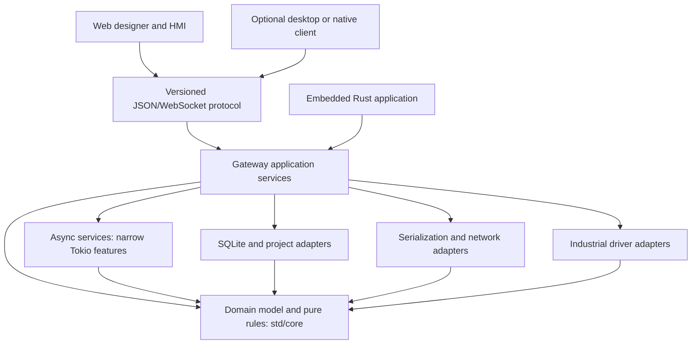

# Architecture and dependency review — September 2026

Reviewed 2026-09-27 against the repository at `549829e` plus the accompanying
toolchain/build changes. This is a restart assessment, not a production readiness
certification or a completed core extraction.

## Recommendation

Keep Rust + Tokio, React + TypeScript, SQLite, JSON/WebSocket, and isolated CPython
workers. Keep one gateway. The accepted [engine and capacity plan](engine-and-capacity.md) supersedes the initial 10K recommendation with a 50K-tag / 50-client Medium target and a separate low-resource profile.
Restructure the dependency boundaries before adding more product breadth. Deliver
the designer in the browser first. Retain the desktop shell as an optional client.

The highest risks are authorization, command correctness, incomplete driver
integration, and failure recovery. Reducing dependency counts helps maintenance,
but does not resolve those risks or establish performance by itself.

## Version inventory

Versions were checked against upstream release documentation and package registry
metadata on the review date. “Available” is a snapshot, not a floating build pin.

| Component | Before | Available at review | This change |
|---|---|---|---|
| Rust contributor toolchain | 1.95.0 | 1.98.1 | Pin 1.98.1; edition remains 2024 |
| Declared Rust minimum | 1.85 | Not a release lookup | Set 1.98.1, the baseline actually validated; older compiler support is not promised |
| rust-ethernet-ip | 1.2.1 manifest and lock | 1.2.1 | Already current; no Cargo.lock changes |
| TypeScript: product apps and libraries | 5.9.3 resolved, ^5.4.0 declared | 7.0.2 | Pin 7.0.2; make component-library output root explicit |
| TypeScript: Astro website | 5.9.3 | 7.0.2; compatibility compiler 6.0.2 | Pin 5.9.3 until the website's compiler-API consumers are upgraded |
| Node in CI | 20 | 24.21.0 LTS; local machine initially 26.10.0 Current | Pin 24.21.0 in .node-version; CI reads it |
| pnpm | 9.0.0 declared; 9.15.9 locally | 12.6.0 | Align pin to tested 9.15.9; major migration remains separate |
| React / React DOM | 18.3.1 | 19.3.0 | Defer paired runtime/designer/component migration |
| Vite / React plugin | 5.4.21 / 4.7.0 | 8.3.1 / 6.1.1 | Priority follow-up with Vitest and Monaco integration |
| Vitest / jsdom | 1.6.1 / 24.1.3 | 5.0.2 / 30.1.1 | Upgrade together with test compatibility checks |
| Astro / Astro check | 5.18.1 / 0.9.8 | 7.3.5 / 0.9.10 | Isolated website migration; then TypeScript 6 compatibility compiler |
| Monaco | 0.55.1 | 0.57.0 | Upgrade alongside locally bundled workers and loader |
| Tauri JS API / CLI | 2.11.1 / 2.11.4 | 2.12.0 / 2.12.0 | Remove unused JS API; defer coordinated native tooling upgrade |

TypeScript 7 has no stable compiler API. Microsoft's guidance still keeps
Astro and similar embedded-language tools on TypeScript 6. The existing Astro 5
graph additionally declares TypeScript 5 peers (`tsconfck`, `zod-to-ts`, and the
installed check package). An attempted 6.0.2 check passed but produced unsupported
peer ranges, so the website stays on 5.9.3 without suppressing compatibility checks.
The Go implementation of the TypeScript compiler does not introduce Go application
source into this repository.

The Rust minimum is deliberately raised rather than continuing an untested 1.85
claim while production code uses newer language/library features. Consumers that
need an older MSRV need a separately tested policy. No industrial protocol pin is
relaxed and no broad Cargo dependency update is included.

Use a scheduled monthly dependency review and expedited security updates. Pin
tested compilers, keep lockfiles, upgrade one compatible tool family at a time,
and run advisory/license checks. The current license validator is not a complete
transitive vulnerability or license audit; this review does not claim one.

## What the code actually does

| Finding | Evidence | Consequence / next step |
|---|---|---|
| Tag engine imports the wire protocol, which imports project storage | `crates/tag-engine/Cargo.toml`, `crates/protocol/Cargo.toml` | SQLite, TOML, serde and storage code enter the reusable tag graph; invert this dependency |
| Public view/binding types live with persistence | `project-store/src/types.rs`, `protocol/src/lib.rs`, `protocol/src/widget_io.rs` | Extract shared schema independently of storage |
| Driver contract includes its supervisor and JSON configuration | `driver-api/src/lib.rs`, `trait_def.rs`, `supervisor.rs` | Separate model/contract from orchestration; retain a migration path for existing drivers |
| Gateway has a library target already, but global services remain | `gateway/src/lib.rs`, six `OnceLock` values in `server.rs` | Build an explicit instance-owned service context; prove two gateways can coexist in one process (CODEX-BX) |
| Gateway only depends on/wires Rockwell | `gateway/Cargo.toml`, `gateway/src/project.rs` | Five driver crates do not mean five selectable end-to-end drivers; complete dispatch/supervision (BI/BJ) |
| A fixed development JWT secret is still the fallback | `gateway/src/main.rs`, `load_auth_context` | Release blocker; fail closed with explicit provisioning (BD) |
| Project/artifact paths use unchecked joins | `project-store/src/store.rs`, `project_dir`, `artifact_path` | Close traversal at every public persistence boundary, with pre-fix regression proof (BC) |
| Tag writes depend on the connection's last opened view ACL | `gateway/src/server.rs`, `current_view_allowed_roles` | Authorize the actual target/action on the server (BF) |
| One tag-store write lock and a 1,024-entry broadcast channel per slot | `tag-engine/src/lib.rs` | Measure allocation, fan-out, slot lifetime and slow-consumer behavior before choosing sharding/coalescing (BW) |
| Designer uses normal browser APIs, with no Tauri JS imports | `apps/designer/src`, `package.json` | Web delivery is viable; remove unused API and make browser build the default |
| Designer URLs default to localhost development servers | `apps/designer/src/App.tsx` | Production deployment needs configured/same-origin HTTPS/WSS routes; a remote user's localhost is not the gateway |
| Monaco wrapper is imported without a local loader configuration | `apps/designer/src/modules/ScriptEditor.tsx`, `vite.config.ts` | Bundled workers alone do not prove offline operation; fix loader and test no external requests |
| Rust and TS protocol definitions are hand-maintained | `crates/protocol/src/lib.rs` | Add shared golden fixtures/schema conformance; do not claim existing code generation |

Baseline dependency inventory: Cargo metadata's workspace-resolved normal/build
closure, excluding dev-only edges but including all target edges and unified
workspace features, contains **66 external packages** for tag-engine, **66** for
protocol, **91** for driver-api, and **201** for gateway. These are not installed
binary sizes or isolated/minimal-feature build counts. The direct dependency count
alone hides the storage coupling. Re-measure with isolated package builds after
extraction and record normal, build, test, and platform-only dependencies separately.

## Target library boundaries

Arrows below mean “depends on.” These are proposed boundaries, not existing crates.

1. **Domain/model:** tag identifiers, values, quality, alarm state transitions,
   command outcomes and validation. No database, filesystem, wall clock, Tokio,
   serde_json, UI or network requirements. Pass time into pure rules. Prefer
   standard error traits here. `no_std` is not a v1 requirement: strings and
   collections need allocation, and this is a desktop/server product.
2. **Async services:** tag subscriptions, driver supervision, lifecycle and bounded
   command queues. Tokio is permitted; replace workspace-wide `features = ["full"]`
   with per-crate requirements and build each package independently to catch feature
   unification hiding missing declarations. Tokio itself has transitive dependencies;
   “std + Tokio” is not literally zero transitive dependencies.
3. **Adapters:** serde/JSON, SQLite, TLS, authentication, driver libraries, tracing
   and Python process management. Keep mature implementations here. Do not write
   custom cryptography, password hashing, TLS, SQL engines or industrial stacks to
   lower the count. `thiserror` is a build-time convenience, not a hot-path runtime;
   prioritize heavy coupling and enabled features before cosmetic removals.
4. **Composition:** `GatewayBuilder`/service context owns stores, drivers, auth,
   cancellation and joins. Caller-provided paths/configuration; no process globals
   or implicit process exit. Expose embeddable services; keep CLI and network server
   as adapters. Optional driver/scripting features should determine the resulting
   dependency graph, with explicit startup errors for unavailable configured drivers.

Start by separating the shared project schema from ProjectStore, preserving public
re-exports and wire JSON. Then extract tag types and pure alarm rules. Only create
an abstraction where there is a demonstrated boundary; do not split every helper
into its own crate or invent a dynamic plugin ABI for v1.

The AGPL core / MPL protocol split needs attention during extraction: the current
MPL Rust protocol crate depends on AGPL project-store. Preserve existing licenses;
decide the shared-schema ownership/license boundary explicitly before moving code.
Do not imply that an MPL manifest alone makes its entire dependency graph MPL or
that embedding an AGPL service grants a different license. External frontends can
use the published wire contract without being tied to a particular GUI toolkit.

## Browser-first and future native clients

The gateway remains an OS process on macOS, Linux or Windows. It owns PLC access;
the browser never needs industrial protocol libraries or direct PLC connections.
Designer and HMI use the same versioned gateway API and project schema.

The default designer build now emits static web assets. The existing Tauri shell
remains available through `build:desktop`. That shell uses a platform webview; it is
not a separate implementation using each OS's native controls. Accepted direction:
reuse the editor UI and isolate filesystem/dialog/keychain capabilities behind host
adapters. Fully native UIs remain possible via the protocol, but would require
separate presentation implementations and an explicit language/toolkit decision.
Do not implement three native designers before the browser product is dependable.

Before releasing the web designer:

- Serve assets offline under a documented HTTPS deployment; route WSS/backup traffic
  consistently and validate origins, roles and session expiry. Keep dev servers out
  of production instructions.
- Bundle Monaco and its workers locally; test with all external requests blocked.
  Add a deliberate CSP instead of inheriting the desktop shell's `csp: null` posture.
- Introduce revision-checked saves, conflict handling and draft/publish separation.
  Editing a production HMI must not unintentionally publish partially authored work.
- Share editor data/commands independently of DOM/desktop APIs. Keep normal browser
  download/upload paths for project assets and an optional host adapter for desktop.
- Verify Chrome/Edge, Firefox and Safari plus keyboard use and responsive layouts.
  Test gateway build/lifecycle/paths on Linux, macOS and Windows separately. An OS
  support intention is not evidence from a three-platform test matrix.

## Performance and operational safety

Benchmark before replacing synchronization or encoding. Use the accepted Edge/Standard/Medium workload
profiles up to 50K tags and 50 clients, defined scan rates and payload sizes, and report hardware,
debug/release configuration, CPU/RSS, p50/p95/p99 tag-to-screen latency, queue depth,
drops, recovery time, historian ingest and query latency. No new speedup is claimed
by this review. Release profiling is appropriate only for a defined performance
investigation; normal correctness validation stays in debug builds.

- Coalesce latest values for display; do not silently discard alarm transitions,
  historian samples or command results using the same policy. On broadcast lag,
  restore a consistent snapshot or explicitly report a gap. A slow historian must
  not block driver polling indefinitely.
- Use bounded queues with explicit overload policy and command deadlines. Never
  replay stale operator setpoints after reconnect (BT); distinguish command receipt,
  PLC write result and observed actual state.
- Batch/paginate persistence work, downsample history in SQL (CG), and cap reads.
  Preserve restart recovery, retention, backup/restore and durable audit semantics.
- Use fine-grained external subscriptions in React instead of rerendering an entire
  HMI per tag update (CB). Add widget error boundaries (BY), query limits and lazy
  editor loading. Prefer existing SVG/CSS components until measurements justify
  another charting/canvas library.
- Python subprocesses isolate crashes, not hostile scripts. Treat script authors as
  privileged, enforce permissions/time/resource limits, and keep scripts off the
  real-time/control responsibility path. This is not a safety-rated control system.

## Implementation order after this baseline

| Order | Work | Exit evidence |
|---|---|---|
| 1 | BC–BH: persistence/auth/write/backup/audit security; BT stale-write protection | Behavior tests fail before fixes; permission and restart tests pass |
| 2 | BI/BJ and BK review, then BL–BQ protocol correctness | Each configured driver runs through the gateway/supervisor; simulator faults and real-hardware gates recorded |
| 3 | BX service context plus shared-schema/domain extraction | Two independent embedded gateways; no storage dependency in domain/protocol graph; unchanged wire fixtures |
| 4 | Web designer release path and CC editing integrity | Offline browser smoke, HTTPS/WSS/origin tests, safe save/publish/conflict behavior |
| 5 | Vite/Vitest/Monaco, React, Astro, then pnpm major upgrades as separate compatible groups | Locked clean install, peer compatibility, unit tests and browser artifacts for each group |
| 6 | BW/CB/CG/CH performance work; CK multi-platform release verification | Reproducible before/after measurements and OS-specific evidence |
| 7 | Resume SCADA usability and packaged demo work before post-v1 manufacturing | Honest feature matrix, restore drill, sustained runtime/hardware tests |

Reviewing the submitted BK driver work and running its 24-hour real-PLC gate remain
separate from confirming its dependency version. Existing briefs are not silently
marked completed by this review. CODEX-BB's old 1.96 proposal is superseded in
direction by this 1.98.1 baseline; its unrelated example-test conversion is omitted.

For competing with Ignition in small/medium installations, prioritize reliable
commissioning, readable alarms, useful trends, reusable views/templates, secure
writes, recoverable deployments and excellent browser authoring. Keep the five
driver scope, but prove it end to end. Defer redundancy/federation, MES breadth and
multiple native UI implementations; do not advertise full Ignition parity.

## Sources and verification record

- [Rust releases](https://blog.rust-lang.org/releases/).
- [rust-ethernet-ip 1.2.1](https://docs.rs/crate/rust-ethernet-ip/1.2.1).
- [TypeScript 7 announcement and compiler API limitations](https://devblogs.microsoft.com/typescript/announcing-typescript-7-0/).
- [Node release support](https://nodejs.org/en/about/previous-releases).
- [Vite supported release lines](https://vite.dev/releases).
- [Ignition Perspective](https://www.docs.inductiveautomation.com/docs/8.3/ignition-modules/perspective)
  and [Designer](https://docs.inductiveautomation.com/docs/8.3/platform/designer).
- Exact frontend versions: `pnpm outdated -r --format json` and targeted `pnpm view`
  on 2026-09-27. This is a version inventory, not an advisory scan.

The accompanying [baseline task](../agents/tasks/CODEX-DK-modernization-baseline.md)
records executed validation and remaining limitations. No Linux/Windows run,
interactive browser smoke, physical PLC test or core extraction is implied by
successful local builds.
